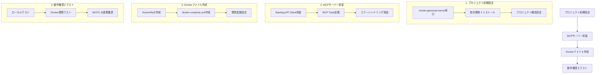

# Backlog MCP サーバー実装計画

## 概要
BacklogのAPIに接続し、課題の取得、検索、更新機能を提供するMCPサーバーをDocker環境で実装します。

## システム構成図



## 実装手順

### 1. プロジェクト初期設定
- MCPサーバープロジェクトの作成（`backlog-mcp-server`）
- 必要な依存関係のインストール
  - `@modelcontextprotocol/sdk`
  - `node-backlog-api`（Backlog API Client）
  - その他必要なパッケージ

### 2. MCPサーバー実装
- 以下のツールを実装：
  ```typescript
  // Tools
  - searchIssues: 課題の検索
  - getIssue: 特定の課題の取得
  - updateIssue: 課題の更新
  ```
- 各ツールのスキーマ定義
- エラーハンドリングの実装

### 3. Dockerファイル作成
```dockerfile
# Dockerfile
FROM node:18-alpine
WORKDIR /app
COPY package*.json ./
RUN npm install
COPY . .
RUN npm run build
CMD ["node", "build/index.js"]
```

```yaml
# docker-compose.yml
version: '3.8'
services:
  backlog-mcp:
    build: .
    environment:
      - BACKLOG_SPACE_URL=https://example.backlog.com
      - BACKLOG_API_KEY=your_api_key
```

### 4. MCPの設定
```json
{
  "mcpServers": {
    "backlog": {
      "command": "docker",
      "args": ["compose", "up", "backlog-mcp"],
      "cwd": "/Users/jootsuki/Documents/Cline/MCP/backlog-mcp-server",
      "env": {
        "BACKLOG_SPACE_URL": "https://example.backlog.com",
        "BACKLOG_API_KEY": "your_api_key"
      }
    }
  }
}
```

## 使用例

```typescript
// 課題の検索
<use_mcp_tool>
<server_name>backlog</server_name>
<tool_name>searchIssues</tool_name>
<arguments>
{
  "projectId": "PROJECT1",
  "keyword": "バグ",
  "status": ["未対応", "処理中"]
}
</arguments>
</use_mcp_tool>

// 課題の更新
<use_mcp_tool>
<server_name>backlog</server_name>
<tool_name>updateIssue</tool_name>
<arguments>
{
  "issueId": "PROJECT1-1",
  "status": "完了",
  "comment": "修正完了しました"
}
</arguments>
</use_mcp_tool>